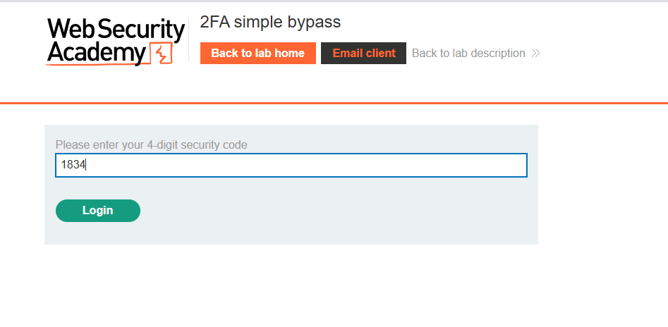
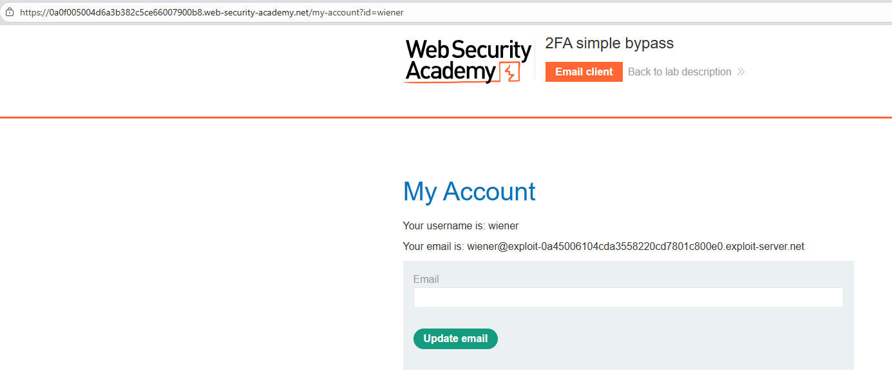
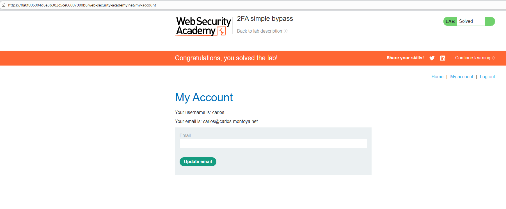

# Lab: 2FA simple bypass

## Mô tả lab

Bài lab này thuộc nhóm lỗi xác thực nhiều lớp, cụ thể là bypass 2FA do logic xử lý phiên đăng nhập không chặt chẽ. Mục tiêu của bài lab là đăng nhập vào tài khoản `carlos` mà không cần biết mã 2FA của người này.

## Các bước thực hiện

### Đăng nhập tài khoản `wiener`

Đầu tiên truy cập ứng dụng và đăng nhập bằng tài khoản được cung cấp sẵn là:

- Username: `wiener`
- Password: `peter`

Sau khi nhập đúng username và password, ứng dụng yêu cầu mã xác thực 4 chữ số.

Ở phía trên giao diện có nút `Email client`, đây là nơi có thể xem email chứa mã 2FA của tài khoản `wiener`. Mở email đó, lấy mã xác thực rồi nhập vào form 2FA.



Sau khi nhập đúng mã, hệ thống chuyển đến trang `/my-account`.



Sau khi hoàn tất cả hai bước xác thực, người dùng sẽ được đưa đến trang tài khoản.

### Thử đăng nhập với tài khoản `carlos`

Tiếp theo, đăng xuất rồi đăng nhập bằng tài khoản:

- Username: `carlos`
- Password: `montoya`

Sau bước nhập đúng username và password, ứng dụng tiếp tục yêu cầu mã 2FA. Tuy nhiên lần này mình không có quyền truy cập email của `carlos`, nên không thể lấy mã xác thực.

Nếu làm theo cách thông thường thì sẽ không thể đăng nhập hoàn chỉnh.

### Bỏ qua 2FA

Do đã biết rằng sau khi xác thực thành công thì ứng dụng thường chuyển đến `/my-account`, mình thử không nhập mã 2FA nữa mà sửa URL thủ công để truy cập trực tiếp:

```text
/my-account
```



Lab solved.