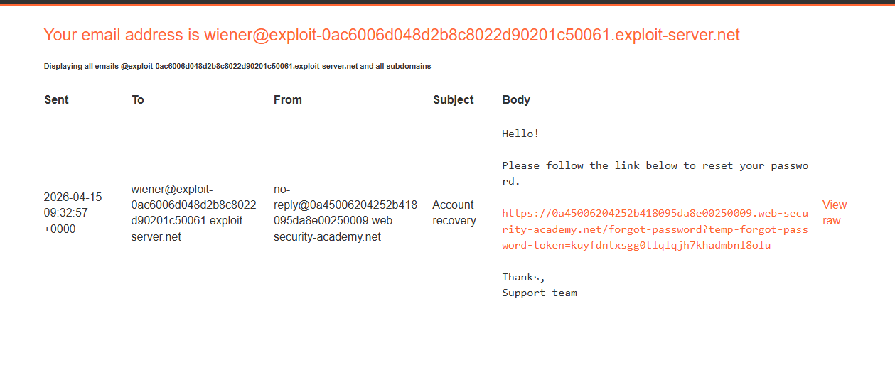
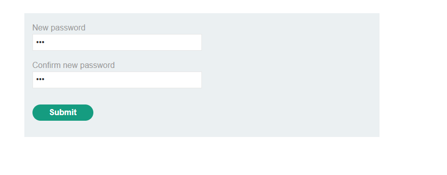
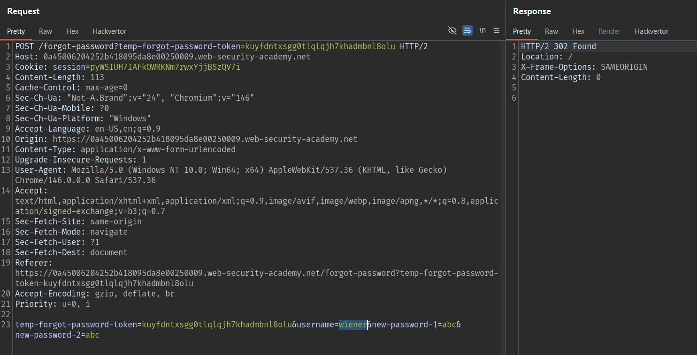
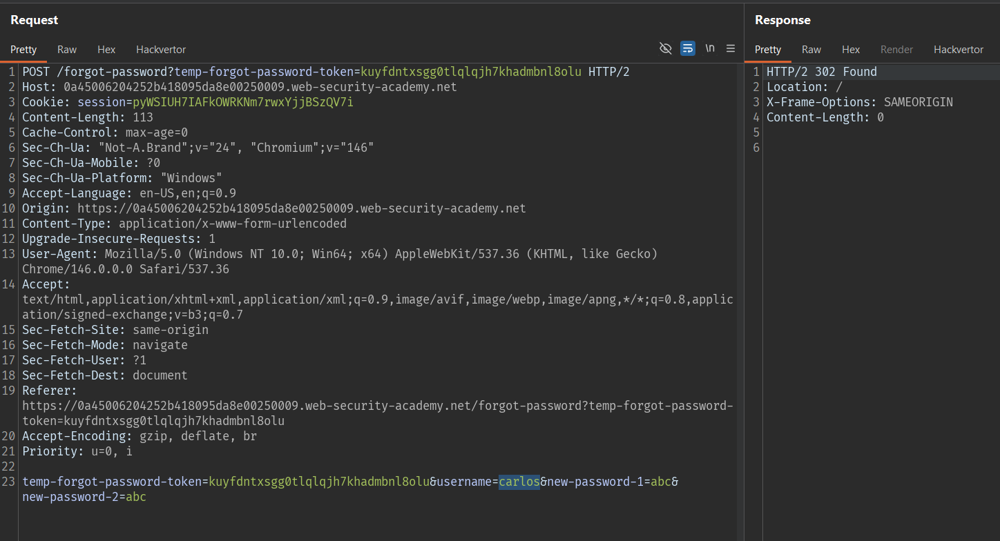
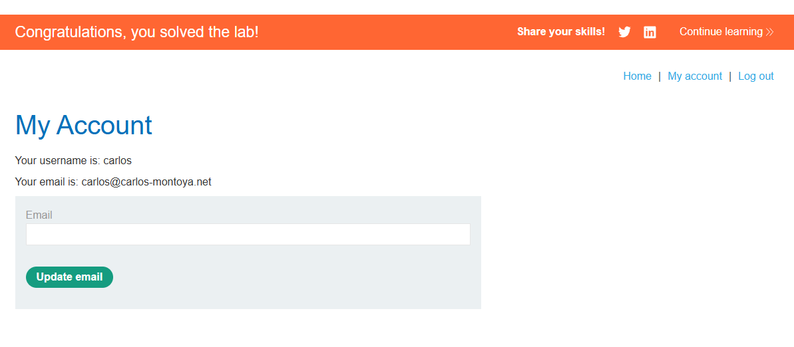

# Lab: Password reset broken logic

## Mô tả lab

Bài lab này sai trong chức năng đặt lại mật khẩu. Mục tiêu của bài lab là chiếm quyền truy cập tài khoản `carlos` bằng cách lợi dụng lỗi trong cơ chế reset password.

## Các bước thực hiện

### 1. Phân tích chức năng reset mật khẩu

Đầu tiên, truy cập chức năng **Forgot password** và thực hiện reset mật khẩu cho tài khoản `wiener`.





Đặt new password là `abc`

Request gửi đi ở bước đầu chỉ chứa username nên nhìn qua chưa thấy gì đặc biệt. Sau đó, hệ thống gửi email reset đến hộp thư của `wiener`.

Mở email và nhấn vào liên kết reset, ứng dụng chuyển đến form nhập mật khẩu mới.

### 2. Quan sát request đổi mật khẩu

Khi nhập mật khẩu mới cho `wiener`, Burp bắt được request `POST` dùng để đổi mật khẩu.

Điểm đáng chú ý là request này có chứa tham số `username`. Đây là dấu hiệu nguy hiểm, vì tên tài khoản cần đổi mật khẩu lẽ ra không nên được tin tưởng từ dữ liệu do client gửi lên.


Tiếp theo, gửi lại quy trình reset cho `wiener` một lần nữa, nhưng lần này chặn request `POST` đổi mật khẩu trong Burp Repeater hoặc Proxy.

Trong request đó, thay giá trị:

```text
username=wiener
```

thành:

```text
username=carlos
```

Giữ nguyên các tham số còn lại và gửi request đi.

Request vẫn được server chấp nhận bình thường, chứng tỏ backend không kiểm tra đúng mối liên hệ giữa tài khoản yêu cầu reset và tài khoản đang bị đổi mật khẩu.

### 4. Đăng nhập vào tài khoản `carlos`

Sau khi request trên được xử lý thành công, thử đăng nhập bằng:

- **Username:** `carlos`
- **Password:** mật khẩu mới vừa đặt

Đăng nhập thành công, từ đó hoàn thành bài lab.

## Nguyên nhân lỗi

Lỗi xảy ra do ứng dụng thiết kế sai logic reset password:

- Server tin tưởng trường `username` do client gửi lên
- Token reset không được ràng buộc đúng với tài khoản tương ứng
- Backend không xác minh rằng request đổi mật khẩu thực sự thuộc về người dùng đã yêu cầu reset ban đầu

Kết quả là chỉ cần có một yêu cầu reset hợp lệ của tài khoản mình kiểm soát, kẻ tấn công có thể chỉnh sửa request để đổi mật khẩu cho người khác.

## Kết quả

Bằng cách yêu cầu reset mật khẩu cho `wiener`, sau đó sửa trường `username` trong request đổi mật khẩu thành `carlos`, mình đã đặt lại mật khẩu của tài khoản `carlos` và đăng nhập thành công.

## Kết luận

Bài lab này cho thấy chỉ cần một lỗi logic nhỏ trong quy trình reset password cũng có thể dẫn đến chiếm quyền tài khoản.

Để tránh lỗi tương tự trong thực tế, hệ thống cần:

- Không tin tưởng tham số `username` từ phía client trong bước đổi mật khẩu
- Ràng buộc chặt token reset với đúng tài khoản đã yêu cầu
- Xác minh phía server rằng token chỉ được dùng để đổi mật khẩu cho một người dùng duy nhất
- Hủy token sau khi sử dụng và kiểm tra đầy đủ trạng thái của yêu cầu reset

