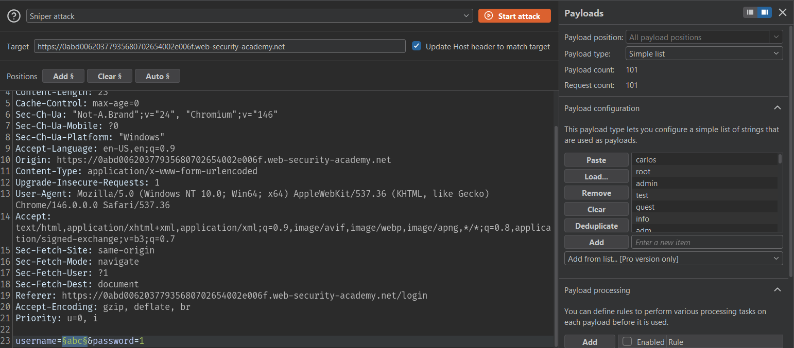
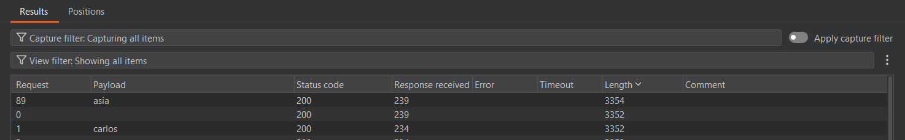
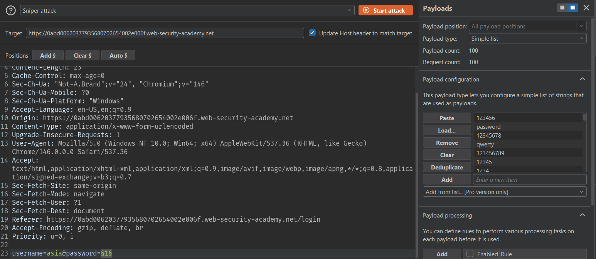
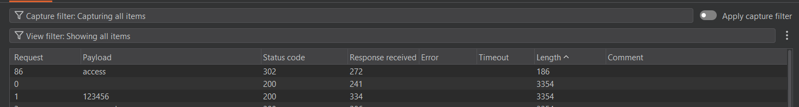
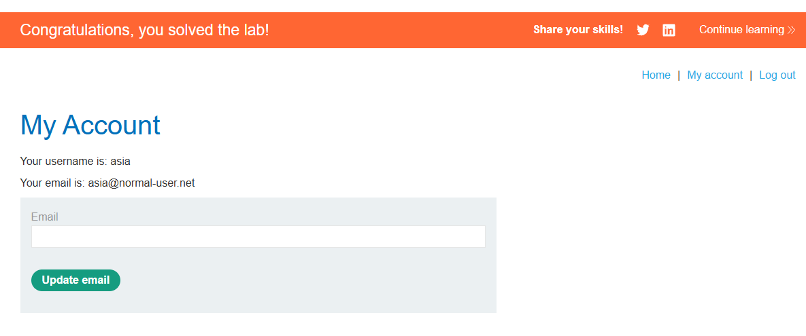

# Lab: Username enumeration via different responses

## Mô tả lab

Bài lab này để lộ thông tin thông qua việc trả về thông báo khác nhau khi đăng nhập thất bại. Thông thường, một hệ thống an toàn sẽ chỉ hiển thị thông báo chung như “Invalid username or password” để tránh tiết lộ cho kẻ tấn công biết là sai ở tên đăng nhập hay mật khẩu.

## Ý tưởng khai thác

Ứng dụng trả về hai kiểu thông báo khác nhau:

- Nếu username không tồn tại, hệ thống báo invalid username
- Nếu username đúng nhưng password sai, hệ thống báo incorrect password

## Các bước thực hiện

### Dò username hợp lệ

Dùng Burp Intruder và cấu hình như sau:

- Attack type: Sniper
- Payload position: chọn tham số `username`
- Payload: danh sách [username](username.txt)





Kết quả tìm được là:

```text
asia
```

### Brute force password

Sau khi đã có username đúng là `asia`, tiếp tục brute force [password](password.txt).





Kết quả password: `access`



Lab solved.
