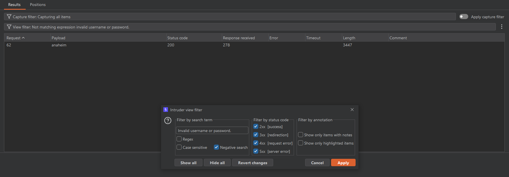
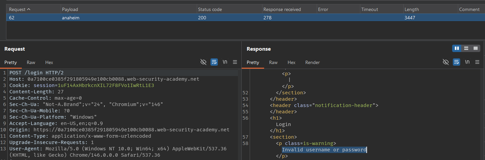
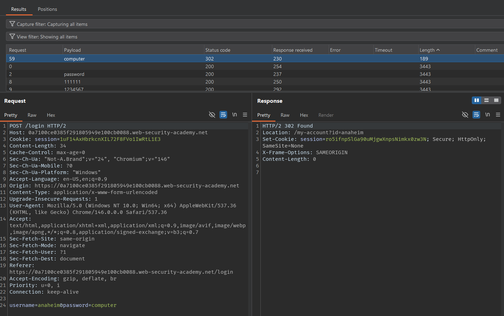
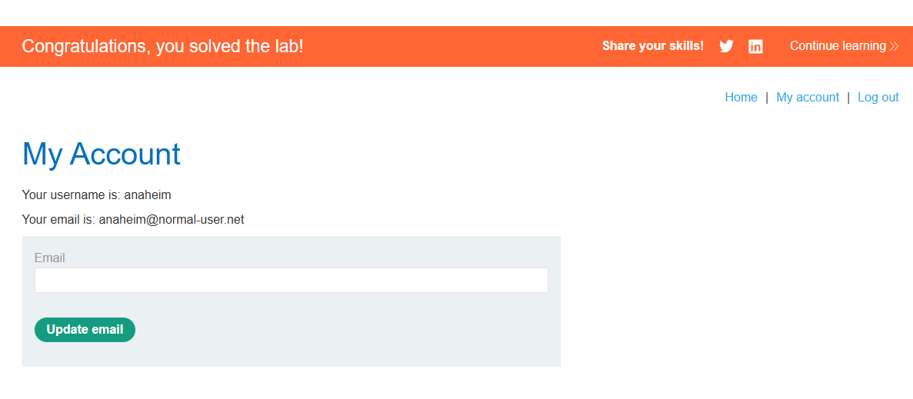

# Lab: Username enumeration via subtly different responses

## Mô tả lab

Bài lab này thuộc nhóm lỗi xác thực,  giữa các trường hợp đăng nhập sai vẫn tồn tại sự khác biệt rất nhỏ trong response, và chính điểm này có thể bị lợi dụng để dò ra username hợp lệ.

## Các bước thực hiện

### Phân tích phản hồi đăng nhập

Đầu tiên, truy cập trang đăng nhập và thử một username cùng password ngẫu nhiên.

```text
Invalid username or password.
```

### Dò username hợp lệ

Đưa request vào Burp Intruder và cấu hình:

- Payload position: tham số `username`
- Payload: [username](username.txt)

Sau đó có thể dùng bộ lọc tìm kiếm để lọc ra những response không khớp với chuỗi:

```text
Invalid username or password.
```



Kết quả cho thấy có một response thiếu dấu chấm ở cuối câu.



Sự khác biệt này cho thấy request đó đi vào một nhánh xử lý khác, đồng nghĩa với việc username trong request là hợp lệ. Username tìm được là:

```text
anaheim
```

### Brute force password

Sau khi đã có username đúng là `anaheim`, tiếp tục brute force [password](password.txt).





Lab solved.