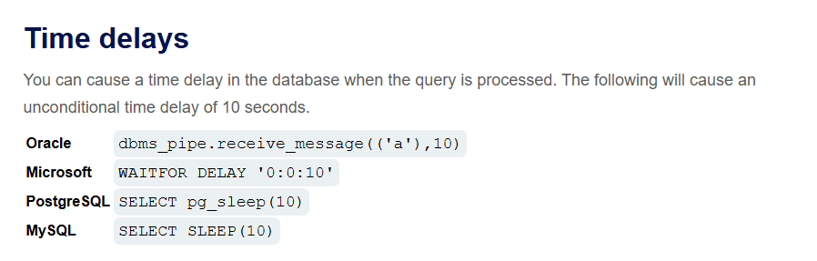
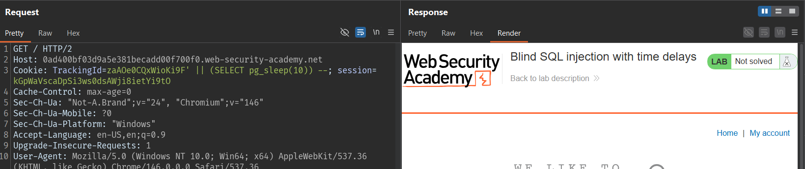
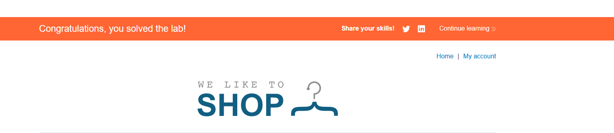

# Lab: Blind SQL injection with time delays

## Mô tả lab

Mục tiêu của bài lab là chứng minh tham số `TrackingId` có thể bị SQL Injection bằng cách chèn payload khiến cơ sở dữ liệu trì hoãn phản hồi trong một khoảng thời gian xác định.

## Ý tưởng khai thác

Đây là dạng blind SQLi, nên việc chèn `'` chưa chắc tạo ra tín hiệu dễ nhận biết trên giao diện. Ứng dụng cũng không trả về thông báo lỗi hay dữ liệu truy vấn. Vì thế, cách kiểm tra phù hợp nhất là sử dụng các payload có chức năng làm chậm truy vấn.

## Test payload

Một số payload time delay thường dùng là:
Theo [SQL injection cheat sheet](https://portswigger.net/web-security/sql-injection/cheat-sheet) cho thấy ví dụ về độ trễ thời gian được đưa ra cho nhiều công cụ cơ sở dữ liệu. Vì chúng ta không biết nên chọn cái nào, chỉ cần thử từng cái một.



Payload:

```sql
SELECT trackingId FROM someTable WHERE trackingId = zaAOe0CQxWioKi9F' || (<CODE HERE>) -- ''
```





Lab solved.