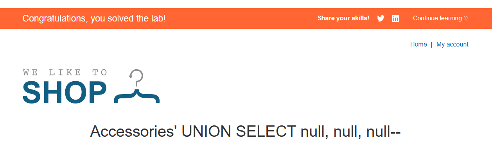

# Lab: SQL injection UNION attack, determining the number of columns returned by the query

## Mô tả lab

Mục tiêu của lab là khai thác **SQL Injection** để xác định số lượng cột mà truy vấn gốc trả về. Đây là bước rất quan trọng trước khi thực hiện các đòn tấn công bằng `UNION SELECT`.

## Các bước thực hiện

### Xác nhận lỗ hổng SQL Injection

Chức năng lọc sản phẩm trong lab hoạt động dựa trên tham số `category` trên URL. Vì vậy, bước đầu tiên là kiểm tra xem tham số này có thể inject được hay không bằng cách cố tình tạo ra lỗi SQL.

Một giá trị hợp lệ bình thường sẽ có dạng:

```text
/filter?category=Pets
```

Trước tiên, mình thêm một dấu nháy đơn (') vào cuối giá trị:

```text
/filter?category=Accessories'
```

Kết quả là ứng dụng trả về Internal Server Error, cho thấy câu truy vấn SQL đã bị lỗi. Khi đó, truy vấn phía server có thể trông như sau:

```sql
SELECT * FROM someTable WHERE category = 'Accessories''
```

Ở đây xuất hiện một dấu nháy đơn thừa ở cuối, làm cho cú pháp SQL không còn hợp lệ. Đây là dấu hiệu khá rõ ràng cho thấy tham số category có thể đang được chèn trực tiếp vào câu truy vấn mà không được xử lý an toàn.

Tiếp theo, mình thử trường hợp “đúng” bằng cách chèn một payload tạo ra câu truy vấn hợp lệ:

```sql
/filter?category=Accessories%27%20or%201=1--
```

Khi đó câu truy vấn trở thành:

```sql
SELECT * FROM someTable WHERE category = 'Accessories' or 1=1--'
```

Kết quả trả về là toàn bộ danh sách sản phẩm, gần giống như khi không áp dụng bộ lọc nào. Điều này cho thấy payload đã hoạt động thành công và xác nhận rằng tham số category thực sự có thể bị khai thác SQL Injection.

### Xác định số cột (UNION SELECT)

Khi sử dụng `UNION`, hai tập kết quả phải có cùng số lượng cột. Vì vậy, để khai thác thành công, trước tiên cần xác định truy vấn gốc đang trả về bao nhiêu cột.

Mình bắt đầu bằng cách inject payload:

```sql
' UNION SELECT null--
```

Payload này gây ra lỗi server, cho thấy số lượng cột trong phần UNION SELECT chưa khớp với truy vấn gốc.

Tiếp theo, mình tăng dần số lượng giá trị null trong payload và thử lại nhiều lần. Mỗi lần thử, mình thêm một null để kiểm tra cho đến khi truy vấn không còn báo lỗi nữa.

Payload đúng trong trường hợp này là:

```sql
' UNION SELECT null, null, null--
```

Lần này truy vấn thực thi thành công, chứng tỏ câu truy vấn gốc có 3 cột.



Lab solved.