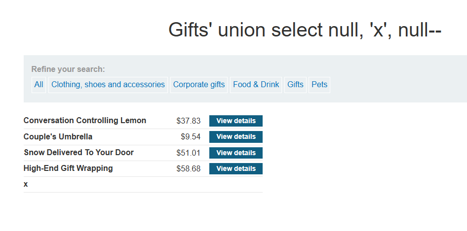
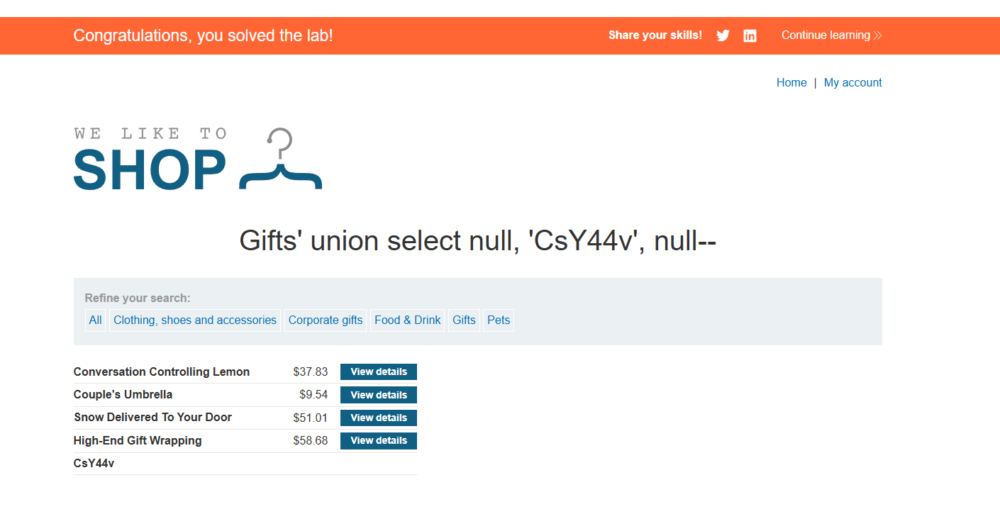

# Lab: SQL injection UNION attack, finding a column containing text

## Mô tả lab

Mục tiêu của lab là xác định cột nào trong kết quả truy vấn có thể chứa **dữ liệu kiểu chuỗi** để sử dụng trong tấn công `UNION SELECT`. Sau đó, cần chèn thành công chuỗi ngẫu nhiên mà lab yêu cầu để hoàn thành bài.

## Các bước thực hiện

Các bước ban đầu gần như giống với lab sau:

- **SQL injection UNION attack, determining the number of columns returned by the query**

Sau khi thử nghiệm, mình xác định được:

- Truy vấn trả về 3 cột

### Tìm cột có thể chứa dữ liệu chuỗi

Các giá trị `null` có thể tương thích với hầu hết kiểu dữ liệu, vì vậy mình bắt đầu với một payload chứa toàn `null`, sau đó thay thế từng vị trí bằng một chuỗi như `'x'` để kiểm tra cột nào chấp nhận dữ liệu dạng text.

Payload:

```sql
' UNION SELECT null, 'x', null--
```

Và kết quả `x` được thêm vào bảng.



Chèn chuỗi lab yêu cầu



Lab solved.