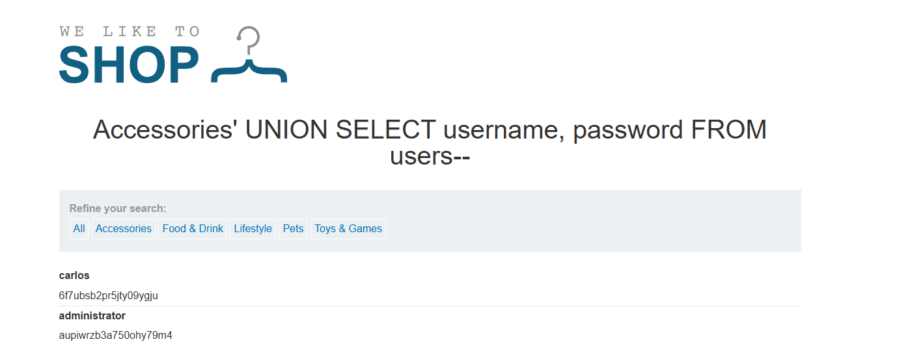
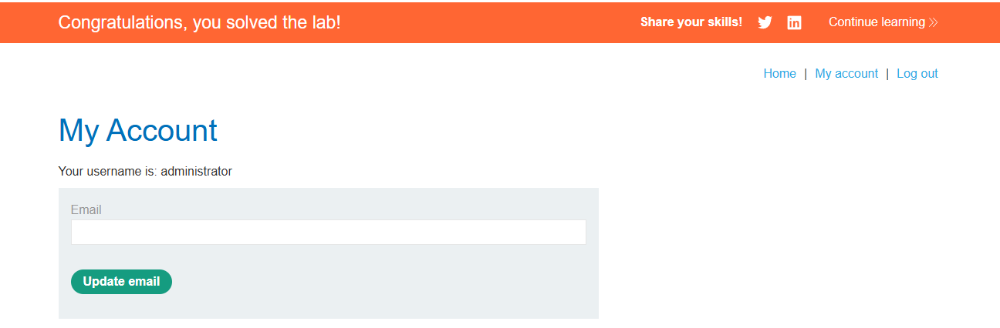

# Lab: SQL injection UNION attack, retrieving data from other tables

## Mô tả lab

Mục tiêu của lab là khai thác SQL Injection dạng UNION để lấy dữ liệu từ một bảng khác trong cơ sở dữ liệu. Cụ thể, cần truy xuất thông tin đăng nhập từ bảng `users`, sau đó đăng nhập bằng tài khoản `administrator` để hoàn thành bài lab.

## Các bước thực hiện

Các bước ban đầu gần như giống với lab sau:

- **SQL injection UNION attack, determining the number of columns returned by the query**

Sau khi thử nghiệm, mình xác định được:

- Truy vấn trả về 2 cột

### Truy xuất username và password từ bảng `users`

Vì đã biết bảng chứa thông tin đăng nhập là `users`, đồng thời truy vấn gốc có đúng 2 cột kiểu chuỗi, mình có thể dùng `UNION SELECT` để lấy trực tiếp dữ liệu từ bảng này.

Payload được sử dụng là:

```sql
' UNION SELECT username, password FROM users--
```

Kết quả:





Lab solved.