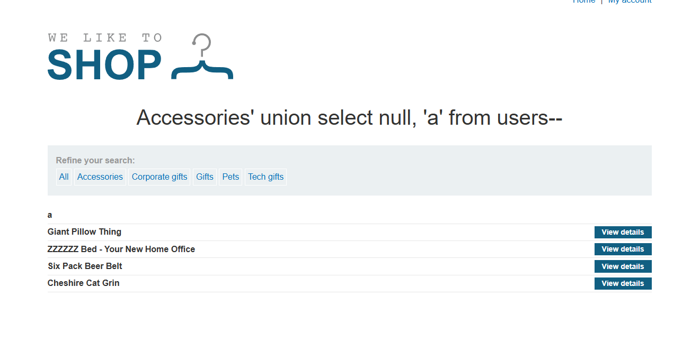
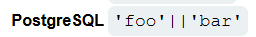
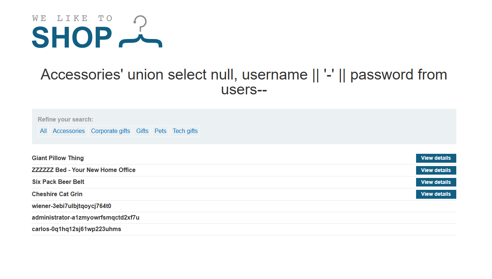
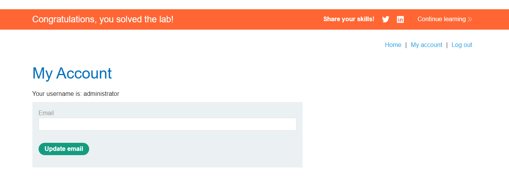

# Lab: SQL injection UNION attack, retrieving multiple values in a single column

## Mô tả lab

Mục tiêu của lab là khai thác SQL Injection dạng UNION để lấy được cả username và password trong khi truy vấn gốc chỉ có một cột có thể hiển thị dữ liệu chuỗi. Để làm được điều đó, cần ghép nhiều giá trị vào cùng một cột rồi dùng kết quả đó để đăng nhập bằng tài khoản `administrator`.

## Các bước thực hiện

Các bước ban đầu gần như giống với lab sau:

- **SQL injection UNION attack, determining the number of columns returned by the query**

Sau khi thử nghiệm, mình xác định được:

- Truy vấn trả về 2 cột

### Truy xuất username và password từ bảng `users`

Vì đã biết bảng chứa thông tin đăng nhập là `users`.

Payload sử dụng là:

```sql
' UNION SELECT username, password FROM users--
```

Payload này gây ra lỗi server, cho thấy chỉ có một cột có thể hiển thị dữ liệu chuỗi. Mình kiểm tra từng cột xem cột nào tương thích với dữ liệu kiểu chuỗi.



Vì mình cần lấy cả `username` và `password` nhưng chỉ có một cột text để hiển thị, nên phải nối nhiều giá trị vào một chuỗi duy nhất.

Theo [SQL injection cheat sheet](https://portswigger.net/web-security/sql-injection/cheat-sheet) cho thấy cách nối chuỗi:



Để có thể phân biệt tên người dùng với mật khẩu, mình nối một số chuỗi duy nhất ở giữa.

Payload sử dụng là:

```sql
' UNION SELECT null, username || '-' || password FROM users--
```





Lab solved.