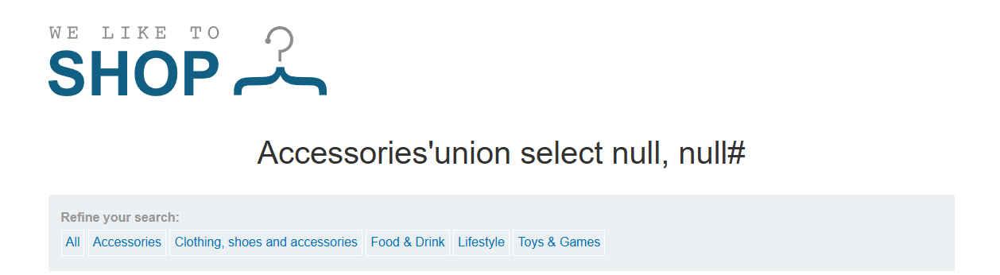
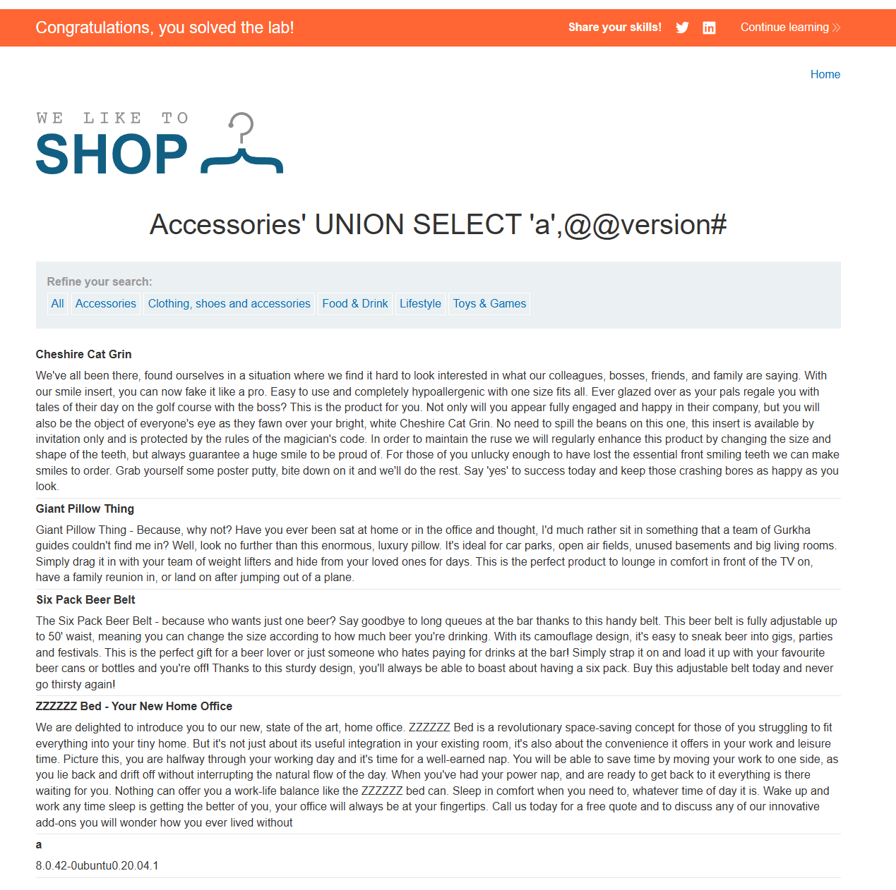

# Lab: SQL injection attack, querying the database type and version on MySQL and Microsoft

## Mô tả lab

Mục tiêu của lab là khai thác SQL Injection để xác định loại cơ sở dữ liệu đang được sử dụng và lấy ra phiên bản của hệ quản trị cơ sở dữ liệu đó. Khi truy vấn thành công thông tin phiên bản, lab sẽ được hoàn thành.

## Các bước thực hiện

Các bước ban đầu gần như giống với lab sau:

- **SQL injection UNION attack, determining the number of columns returned by the query**

Điểm khác biệt là trên MySQL ký tự `#` thích hợp hơn để bắt đầu một comment thay vì `--`.

Sau khi thử nghiệm, mình xác định được:

- Truy vấn trả về 2 cột

### Query version

Theo [SQL injection cheat sheet](https://portswigger.net/web-security/sql-injection/cheat-sheet) cho thấy truy vấn cần dùng trên MySQL và MSSQL.

Vì vậy mình cần chèn `' UNION SELECT 'a',@@version#` để lấy thông tin phiên bản.

Kết quả nhận được:

Lab solved.