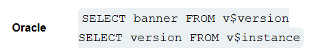
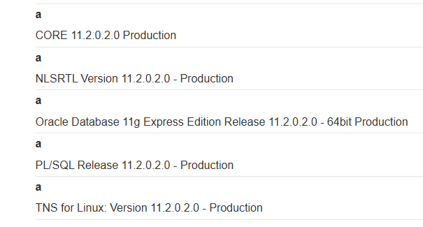
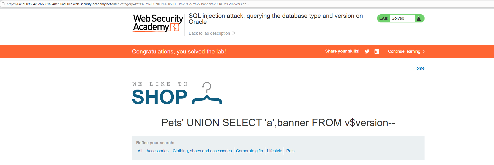

# Lab: SQL injection attack, querying the database type and version on Oracle

## Mô tả lab

Mục tiêu của lab là khai thác SQL Injection để xác định loại cơ sở dữ liệu đang được sử dụng và lấy ra phiên bản của hệ quản trị cơ sở dữ liệu đó. Khi truy vấn đúng phiên bản, lab sẽ được hoàn thành.

## Các bước làm

Các bước ban đầu gần như giống với lab sau:

- **SQL injection UNION attack, determining the number of columns returned by the query**

Trên cơ sở dữ liệu Oracle, mọi câu lệnh phải chỉ định một bảng để chọn . Nếu cuộc tấn công của bạn không truy vấn từ bảng, bạn vẫn cần bao gồm từ khóa theo sau là tên bảng hợp lệ.

Sau khi thử nghiệm, mình xác định được:

- Truy vấn trả về 2 cột

### Query version

Theo [SQL injection cheat sheet](https://portswigger.net/web-security/sql-injection/cheat-sheet) có 2 phương pháp truy vấn phiên bản cơ sở dữ liệu khác nhau trên Oracle.

`SELECT banner FROM v$version` chỉ trả về số phiên bản, `SELECT version FROM v$instance` trả về chuỗi phiên bản đầy đủ được yêu cầu.

Vì vậy mình cần chèn `' UNION SELECT 'a',banner FROM v$version--` để lấy thông tin phiên bản.

Kết quả nhận được:

Lab solved.