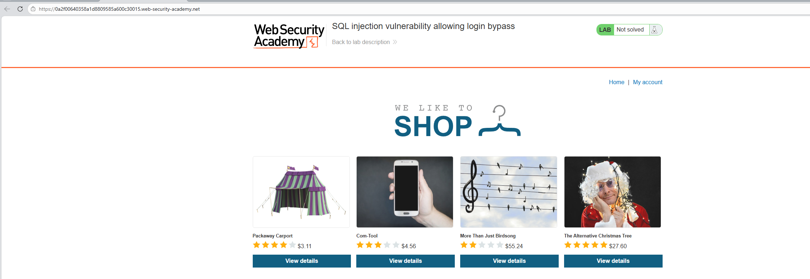
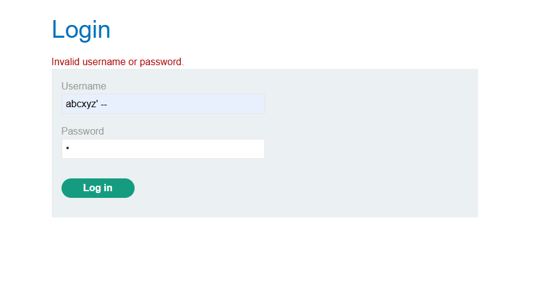
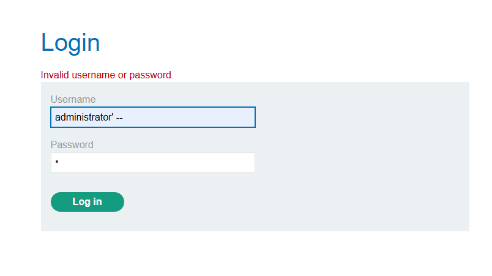
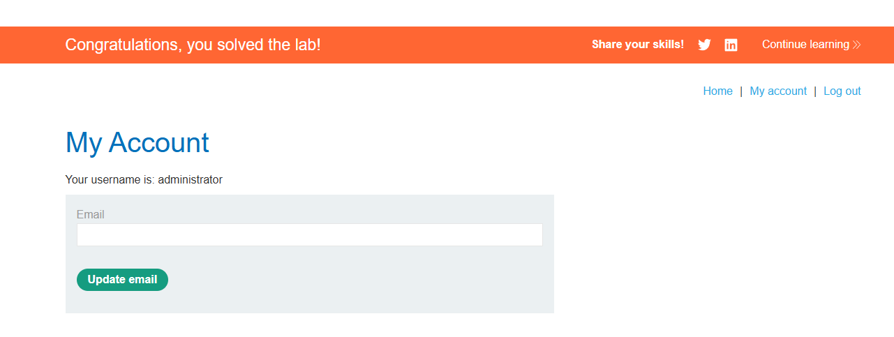

# Lab: SQL injection vulnerability allowing login bypass

Đây là giao diện của ứng dụng. Chúng ta có mục “My Account”.

My Account sẽ dẫn đến trang đăng nhập.

Tại trang đăng nhập này, có thể thử khai thác bằng kỹ thuật SQL Injection thông qua phương thức POST. Vì vậy, bước tiếp theo là kiểm tra xem cơ chế đăng nhập có thể bị bypass hay không.

Ở bước đầu, chúng ta thử bypass cơ chế xác thực, nhưng ứng dụng trả về thông báo `Invalid username or password`. Tuy nhiên, chúng ta biết rằng hệ thống có tồn tại một người dùng tên administrator. Vì vậy, bước tiếp theo là thử sử dụng tên đăng nhập này để xem có thể vượt qua cơ chế đăng nhập hay không.

Và kết quả là chúng ta đã vào được tài khoản Admin

Lab solved.