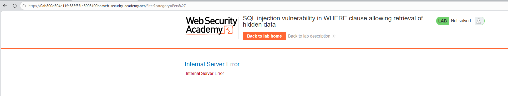
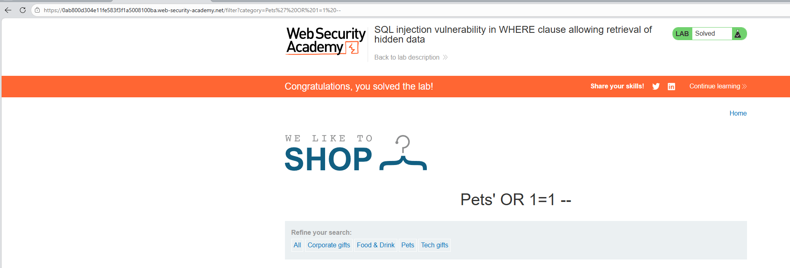

# Lab: SQL injection vulnerability in WHERE clause allowing retrieval of hidden data

## Mô tả lab

Bài lab này chứa lỗ hổng **SQL Injection** trong tham số lọc danh mục sản phẩm. Ứng dụng sử dụng giá trị `category` từ URL để tạo câu truy vấn SQL, từ đó hiển thị các sản phẩm tương ứng.

## Các bước thực hiện

## Test lỗ hổng

Thêm dấu `'` sau 1 category (ví dụ Lifestyle) để kiểm tra xem có lỗ hổng SQL injection hay không. 



Kết quả trả về là Internal Server Error, cho thấy truy vấn SQL phía backend đã bị lỗi cú pháp. Điều này xác nhận rằng tham số `category` có thể đang được đưa trực tiếp vào câu lệnh SQL mà không được xử lý an toàn, từ đó cho thấy ứng dụng có khả năng tồn tại lỗ hổng SQL Injection.

## Khai thác lỗ hổng

Payload được sử dụng:

```sql
' OR 1=1 --
```

Khi payload này được chèn vào tham số category, điều kiện lọc ban đầu của ứng dụng bị vô hiệu hóa



Lab solved.