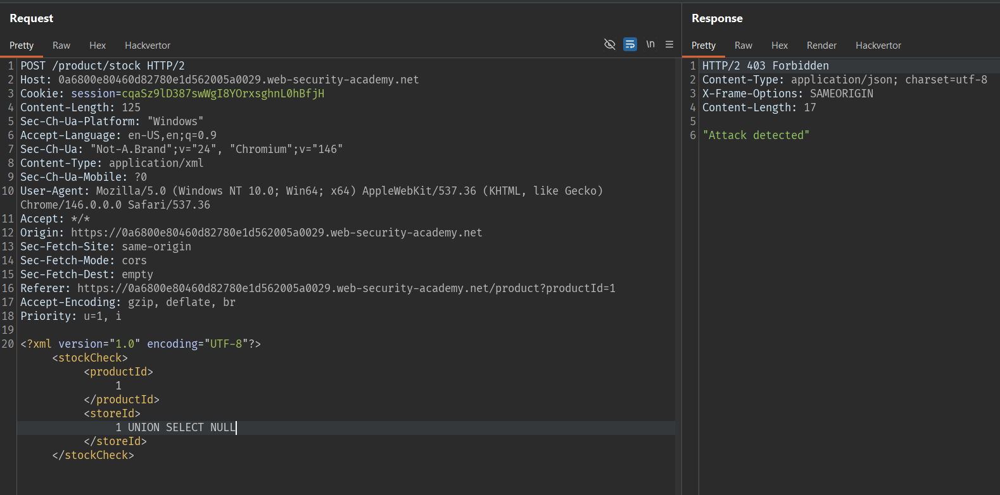
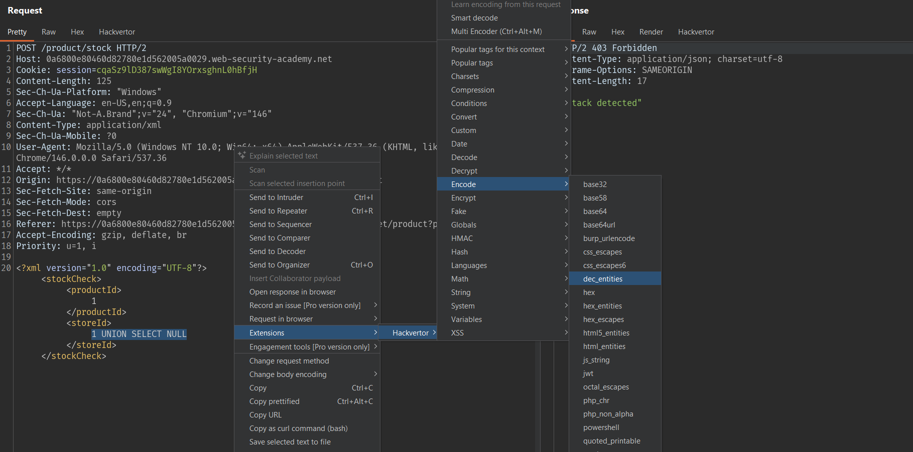
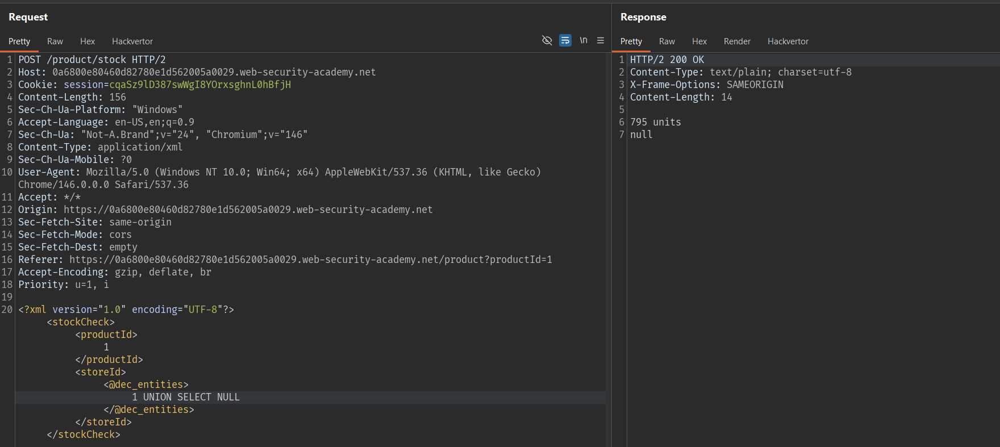
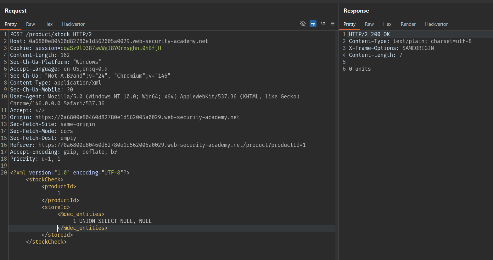
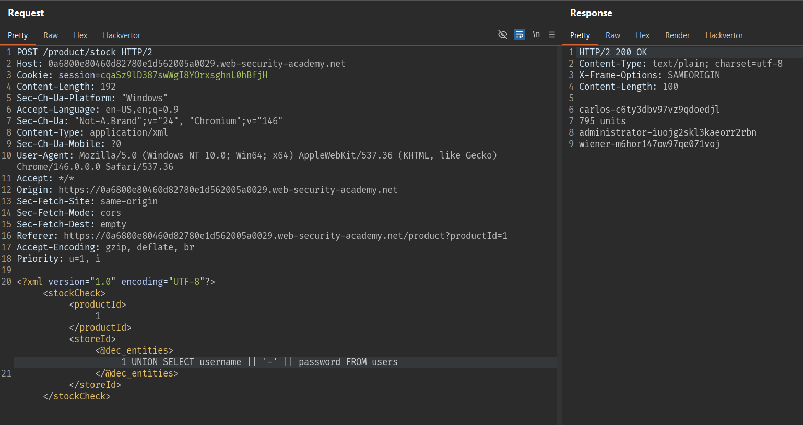
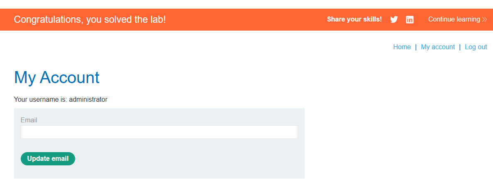

# Write-up: SQL injection bypass bộ lọc bằng mã hóa XML tại PortSwigger Academy

## Mô tả lab

Trong lab này, ứng dụng có cơ chế lọc nhằm ngăn chặn các payload SQL injection thông thường. Nhưng do dữ liệu được gửi dưới dạng XML, ta có thể lợi dụng việc mã hóa ký tự bằng XML entities để vượt qua bộ lọc/WAF và chèn câu lệnh SQL độc hại.

## Các bước thực hiện

Theo gợi ý trong mô tả lab, mình sử dụng extension Hackvertor của Burp Suite.

### Thử chèn payload SQL cơ bản

Tiếp theo, mình muốn xem điều gì xảy ra nếu chèn một câu lệnh SQL đơn giản. Mình kiểm tra riêng cả hai tham số:

- `productId`
- `storeId`

Lý do là ở thời điểm đầu mình chưa biết câu lệnh SQL phía sau được xây dựng như thế nào, cũng chưa biết tham số nào có thể inject được.

Ban đầu, kết quả của cả hai trường hợp đều giống nhau, nên mình minh họa với `productId`.



Khi chèn payload SQL thông thường, ứng dụng trả về 403 Forbidden. Điều này cho thấy đang có một cơ chế bảo vệ chặn các mẫu request đáng ngờ.

Vì vậy, chúng ta cần làm cho payload đầu vào trở nên khó bị phát hiện hơn, để có thể vượt qua cơ chế kiểm tra của WAF. Để thực hiện điều đó, mình sử dụng một extension của Burp Suite tên là Hackvertor. Hackvertor có thể hiển thị trực tiếp kết quả encode trong giao diện.





## Kiểm tra số cột



Kết quả cho thấy chỉ có 1 cột trong truy vấn.

Vì vậy, chúng ta có thể xuất nội dung trong 1 cột, mình sẽ xuất nội dung của 2 cột `username` và `password` bằng cách nối chuỗi:

```sql
UNION SELECT usename || '-' || password FROM users
```





Lab solved.